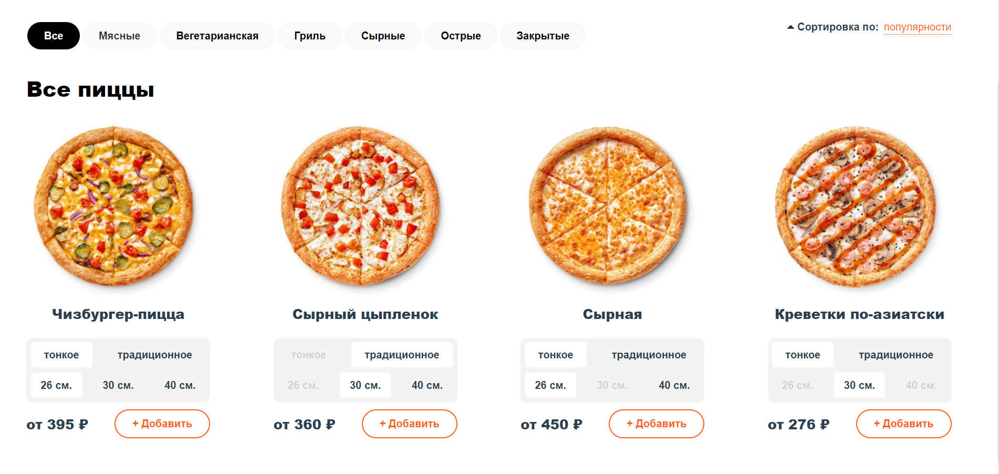
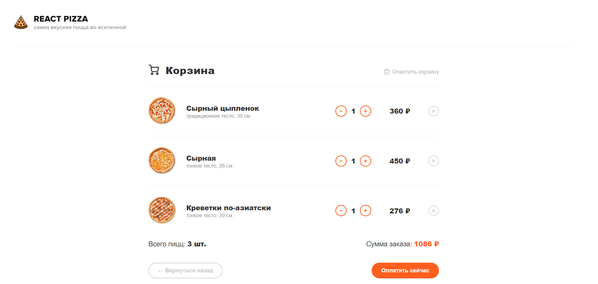
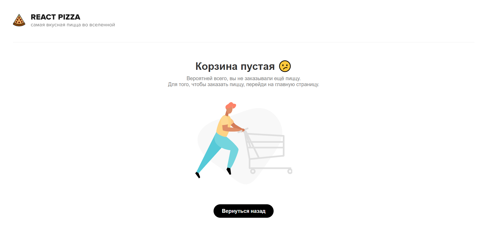

<h1 id="top" align="center" style="font-weight:">Pizza shop</h1>

<h3 align="right" style="font-weight:">
  Try <a href="https://zif1r.github.io/pizza-shop/">Live Demo</a>
</h3>

<details>
  <summary>Table of contents:</summary>
  <ul>
    <li><a href="#description">Short review of project</a></li>
    <ul>
      <li><a href="#facilities">Main facilities</a></li>
      <li><a href="#stack">Technological stack</a></li>
    </ul>
    <li><a href="#screenshots">Screenshots</a></li>
    <ul>
      <li><a href="#products">Products page</a></li>
      <li><a href="#cart">Cart page</a></li>
      <li><a href="#empty_cart">Empty-cart page</a></li>
    </ul>
    <li><a href="#setup">Project setup</a></li>
  </ul>
</details>

<h1 id="description" style="font-size: 27px">Short review of project</h1>

<h2 id="facilities" style="text-decoration: underline">Main facilities</h2>

- Sorting of products by name/cost/popularity
- Filtering of products by its composition
- Choosing of characteristics of the products like size/dough
- Live view of product cost when user change characteristics of the products
- Adding products to cart
- Live view of total cost and count of the all products in cart
- Clearing the cart in one click

<h2 id="stack" style="text-decoration: underline">Technological stack</h2>

- Vue.js & Vuex & Vue Router
- JavaScript
- SCSS

<h1 id="screenshots">Screenshots</h1>

<h3 id="products">Products page</h3>



<h3 id="cart">Cart page</h3>



<h3 id="empty_cart">Empty-cart page</h3>



<h1 id="setup">Project setup</h1>

### Download dependencies
```
npm install
```

### Compiles and hot-reloads for development
```
npm run serve
```

### Compiles and minifies for production
```
npm run build
```

### Lints and fixes files
```
npm run lint
```
